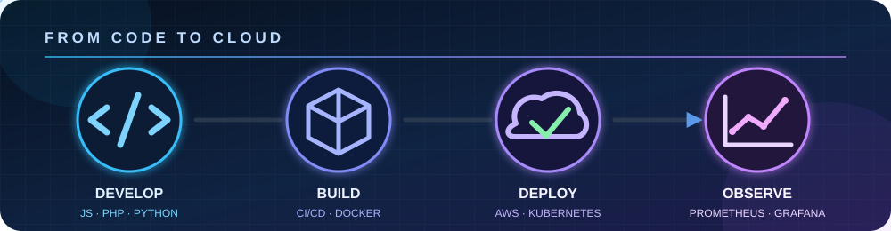

<h2 align="center">Languages & Tools</h2>

  
  
  
  
  
  
  
  
    
  
  
  
  
  
  
  
  

  

<h2 align="center">GitHub Stats</h2>

  
  

<h2 align="center">Contribution Activity</h2>

<picture>
  <source media="(prefers-color-scheme: dark)" srcset="./profile/contribution-snake-dark.svg" />
  <source media="(prefers-color-scheme: light)" srcset="./profile/contribution-snake.svg" />
  
</picture>
