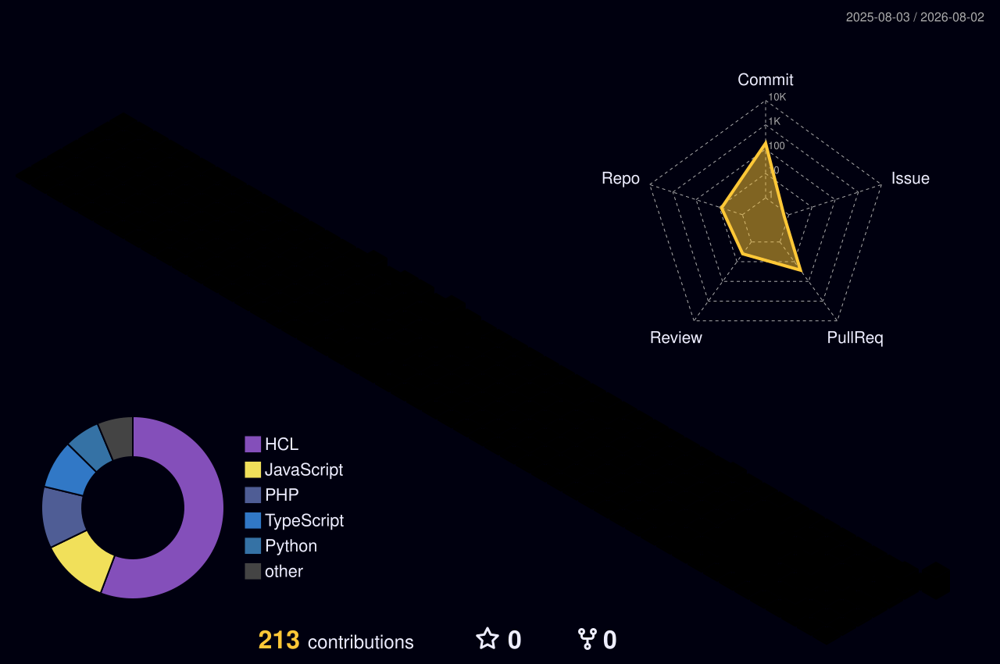

Building practical web services and reliable cloud infrastructure — from code to production.

## About me

Final-year Information Technology student and backend-focused developer who enjoys connecting application development with the infrastructure that runs it.

- **Web:** REST APIs and full-stack applications with JavaScript, PHP, Python, Node.js, Laravel, and React.
- **Cloud:** Hands-on work with AWS, Terraform, Docker, Kubernetes, CI/CD, and GitOps.
- **Focus:** Maintainable delivery, cloud security, observability, and continuous learning.

## Languages and tools

  
  
  
  
  
  
  
  
    
  
  
  
  
  
  
  
  
    
  
  
  
  
  

## Selected work

Four builds across the same engineering path: create the product, automate delivery, govern the platform, and observe it in production.

### Web engineering

> [**Badminton Shop API**](https://github.com/huynhhuan/badminton-shop-be) — Laravel commerce API with authentication, orders, and VNPay.
>
> [**GreenCart**](https://github.com/huynhhuan/W6-BE-greencart) — Containerized MERN shop with payments and cloud health signals.

### Cloud and DevOps

> [**AWS Accelerator Platform**](https://github.com/huynhhuan/bahuan-aws-accelerator-p2) — Infrastructure-to-GitOps delivery with Terraform, EKS, and observability.
>
> [**EKS Governance Platform**](https://github.com/TF4-Phase3-TechX) — Audit-ready controls with AWS Config, CloudTrail, and least-privilege IAM.

## GitHub activity

A live view of my public work — code first, cloud next, always improving.

  
   
  

<strong>View 3D contribution activity</strong>

 

## Current focus

Backend services · AWS Infrastructure as Code · Kubernetes and GitOps · Monitoring and observability
